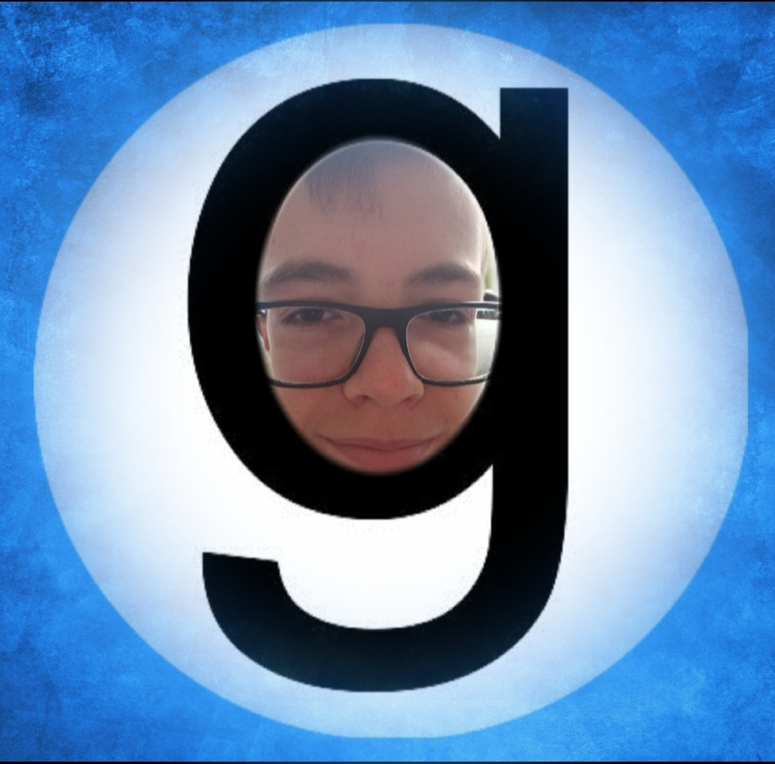
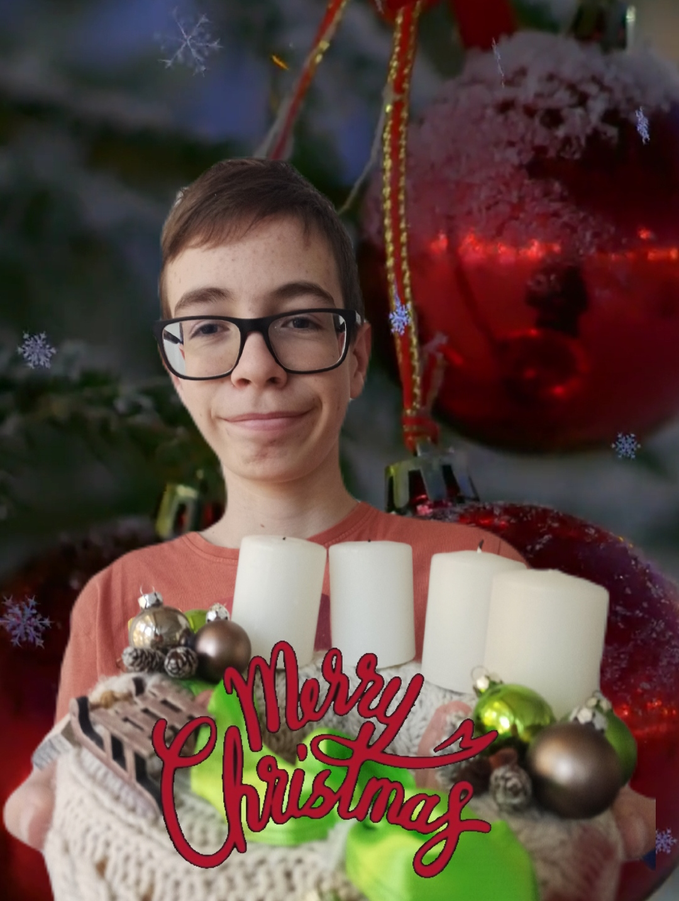

<!DOCTYPE html>
<html lang="hu">
<head>
    <meta charset="UTF-8">
    <meta name="viewport" content="width=device-width, initial-scale=1.0">
    <title>Gorduska PodCast Official Merch</title>
    
</head>
<body>

<h1>Gorduska PodCast Official Merch</h1>
<h2>Exkluzív Merch Kollekció</h2>

    

        
        <h3>OG Merch</h3>
        
6000Ft

        <!-- "Megnézem" gomb eltávolítva -->
    

    

        
        <h3>Karácsonyi Merch</h3>
        
6000Ft

        <!-- "Megnézem" gomb eltávolítva -->
    

    

        <h3>Mindkettő</h3>
        
10000Ft (17% akció)

        <!-- "Megnézem" gombot itt eltávolítva -->
    

<!-- Gomb a Gmail linkhez -->
<a href="mailto:gorduskapodcast@gmail.com?subject=Vásárlás" target="_blank">
    <button type="button">E-mail küldése</button>
</a>

<!-- Gomb a YouTube linkhez -->
<a href="https://youtu.be/mnjOLKoLiX8" target="_blank">
    <button type="button">Tutorial (fontos) </button>
</a>

<a href="https://youtube.com/shorts/gc2SFRRbQHM" target="_blank">
    <button type="button">Tutorial (fizetésről) </button>
</a>

</body>
</html>
